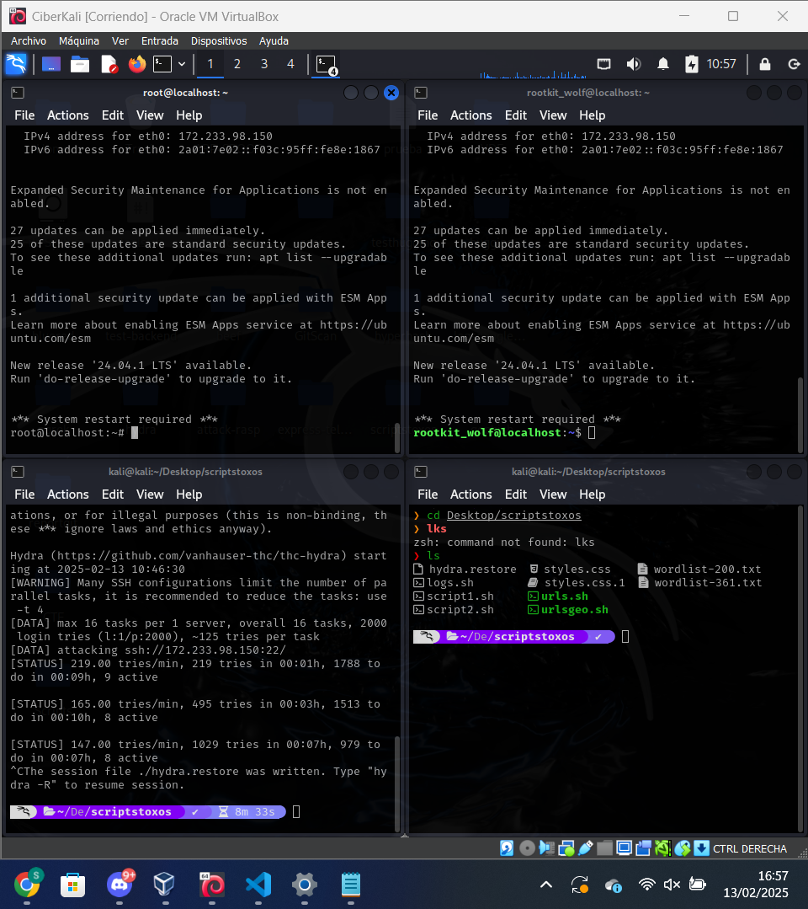
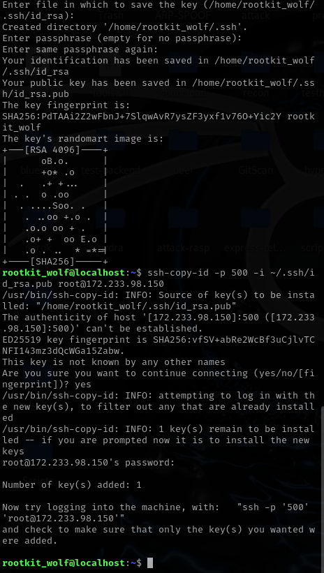
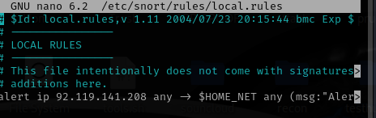
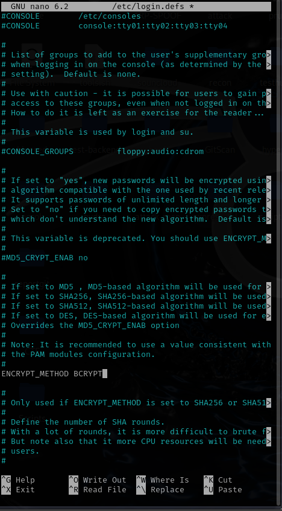

### REDBLUE

- 1ºReconocimiento servicios

- 2ºAcceder al usuario

- 3º Sustituir imagen

- 4º Canarytoken

- 5ºCambiar puerto SSH

- Puerto web

- RSA

- 6ºWazuh

- 7º Snort

- 8º Honeypot

- 9º Algoritmo

- 10º Pings a otro jugador

- 11º Acceder al servidor de otro jugador

- 12º Modificar web otro jugador

- 13º Denegación de servicios

- 14º Cambiar SSH otro jugador

- 15º Añadir claves RSA de acceso a otro jugador

- 16º Elimina las claves RSA de otro jugador

- 17º Detecta intento de instrusión desde la NAT de la escuela

- 18º Roba logs de usuario

- 19º Roba pcapc de usuario

- 20º Elimina logs del usuario

- 21º Elimina pcaps del usuario